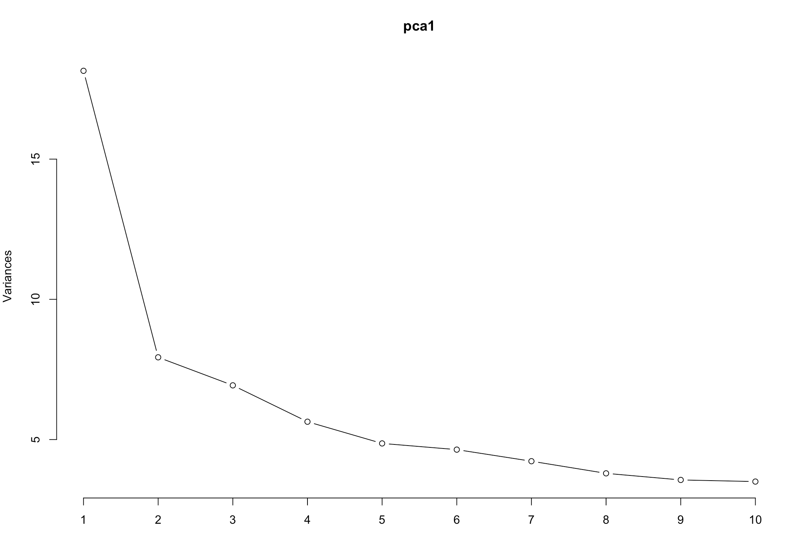
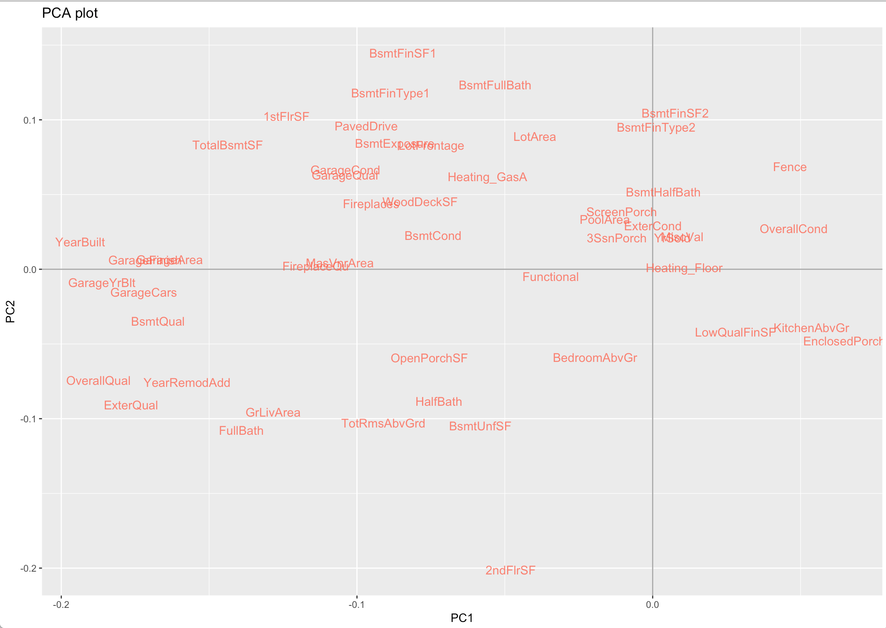
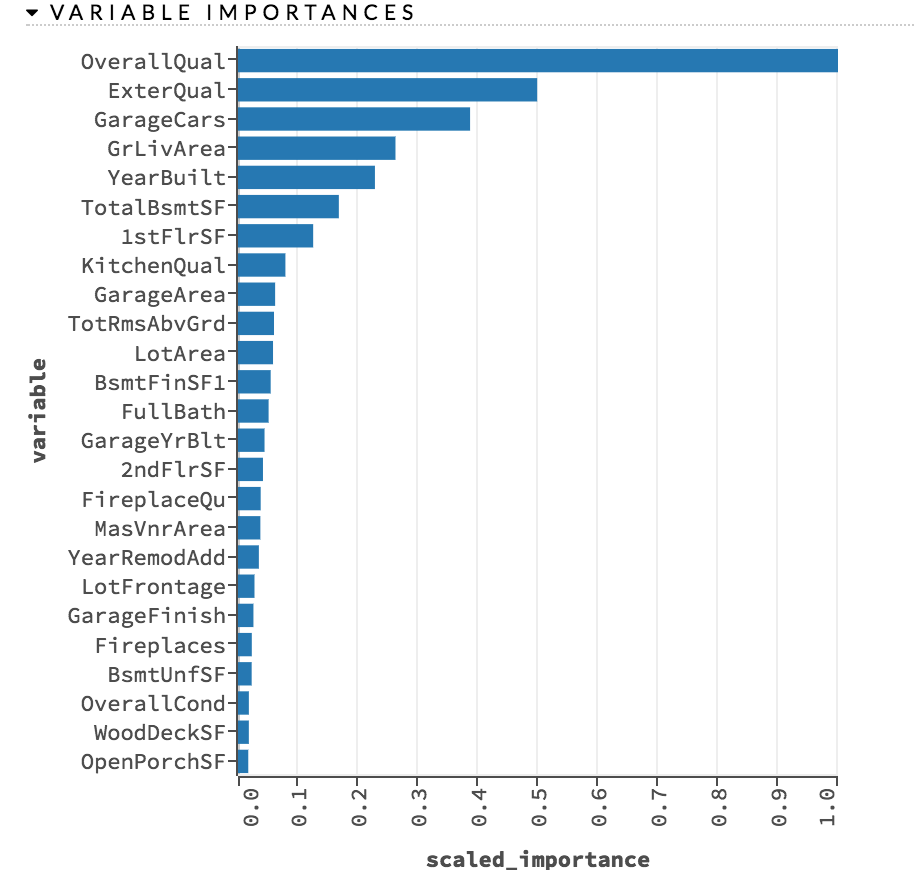
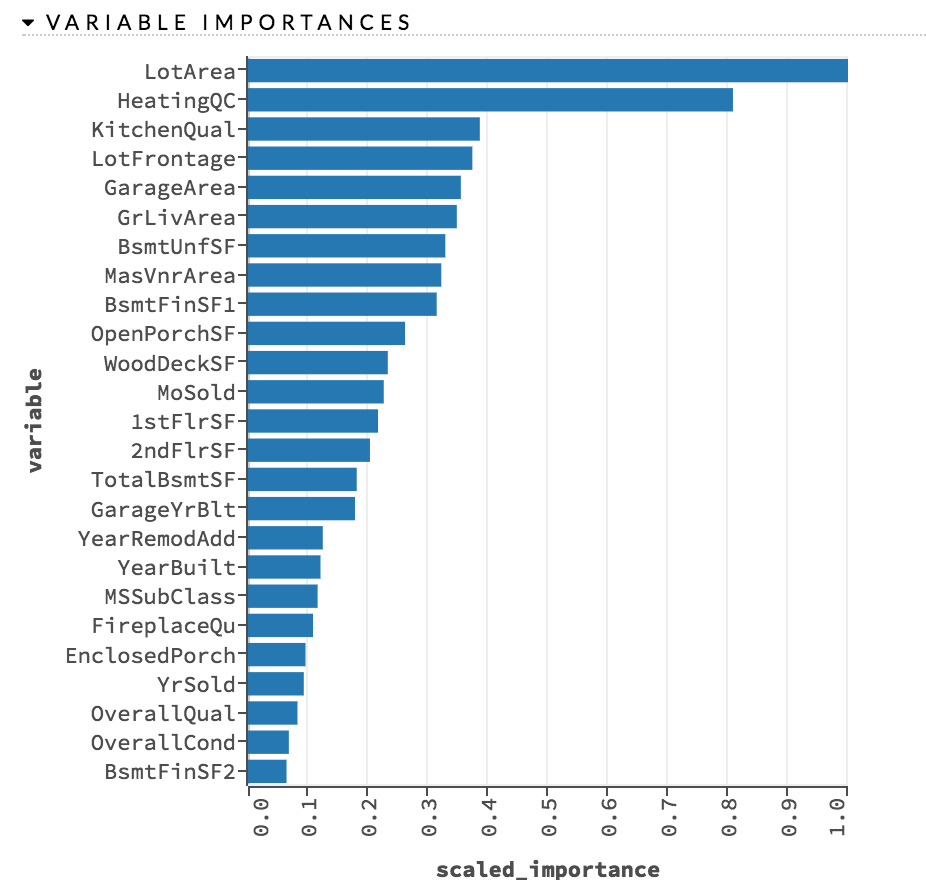

```{r setup, include=FALSE}
knitr::opts_chunk$set(echo = TRUE)
```

## 1 Overview and Motivation

Growing unaffordability of housing has become one of the major challenges for metropolitan cities around the world. In order to gain a better understanding of the commercialized housing market we are currently facing, we want to figure out what are the top influential factors of the housing price. Apart from the more obvious driving forces such as the inflation and the scarcity of land, there are also a number of variables that are worth looking into. Therefore, we choose to study the house prices predicting problem on Kaggle, which enables us to dig into the variables in depth and to provide a model that could more accurately estimate home prices. In this way, people could make better decisions when it comes to home investment.

Our object is to discuss the major factors that affect housing price and make precise predictions for it. We use 79 explanatory variables including almost every aspect of residential homes in Ames, Iowa. Methods of both statistical regression models and machine learning regression models are applied and further compared according to their performance to better estimate the final price of each house. The model provides price prediction based on similar comparables of people’s dream houses, which allows both buyers and sellers to better negotiate home prices according to market trend. 


## 2 Related Work

#### 2.1 Stepwise Selection
Stepwise Selection combines elements of both forward selection and backward elimination, allow us either to remove covariates from our previous model or add back in covariates that we had previously eliminated from our model, and in this sense, giving us chances to consider all possible subsets of the pool of explanatory variables and find the model that best fits the data according to some prespecified criterion, such as AIC(Akaike Information Criterion), BIC(Bayesian Information Criterion), and adjusted R2.

Reference: Jennrich, Robert I. "Stepwise regression." Statistical methods for digital computers 3 (1977): 58-75.

#### 2.2 LOWESS
LOWESS (Locally Weighted Scatterplot Smoothing), or LOESS (Locally Weighted Smoothing), is often applied in regression analysis that creates a smooth line through a scatter plot. It is especially helpful when detecting nonlinear relationship between variables and predicting trends. In our study, LOWESS was first used to detect potential nonlinear associations between variables and sale prices. Since it performed the best results compared to other smoothing methods,  we then used it to predict prices after PCA preprocessing. 

Reference: Cleveland, William S. "LOWESS: A program for smoothing scatterplots by robust locally weighted regression." The American Statistician 35.1 (1981): 54-54.

#### 2.3 PCA
PCA (Principal Component Analysis) is a statistical procedure that uses an orthogonal transformation to convert a set of observations of possibly correlated variables into a set of values of linearly uncorrelated variables called principal components [1].
As mentioned in class, we can’t estimate the estimators of a high-dimensional nonlinear model via lm function. So we applied PCA to estimate predictors by minimizing  the squared error of the approximation.

Reference: Abdi, H. and Williams, L.J., 2010. Principal component analysis. Wiley interdisciplinary reviews: computational statistics, 2(4), pp.433-459.

#### 2.4 Lasso Regression
Lasso (Least Absolute Shrinkage and Selection Operator) regression is a regularized linear regression. It uses L1 norm to constrain the coefficients of the fitting model. Usually, some coefficients will be set to 0 under the constrain. Therefore, the lasso regression is more robust compared to ordinary linear regression. 

Reference: Tibshirani, Robert. "Regression shrinkage and selection via the lasso." Journal of the Royal Statistical Society. Series B (Methodological) (1996): 267-288.2

#### 2.5 Random Forest
Random forest is an ensembling machine learning method basing on classification tree or regression tree. In general, random forest will generate many decision trees and average their predictions to make the final prediction. When generating each decision tree, the random forest will use a subset of all features, which avoids the overfitting problem. 

Reference: Liaw, Andy, and Matthew Wiener. "Classification and regression by randomForest." R news 2.3 (2002): 18-22.

#### 2.6 Gradient Boosting

Similar to random forest, gradient boosting is another ensembling machine learning method basing on classification tree or regression tree. While in random forest every tree is weighted the same, every tree in gradient boosting tries to minimize the error between target and trees built previously. Gradient boosting is now a popular machine learning framework for both academia and industry. 

Reference: Friedman, Jerome H. "Greedy function approximation: a gradient boosting machine." Annals of statistics (2001): 1189-1232.

#### 2.7 Ensemble Learning

Ensemble learning combines multiple statistical and machine learning algorithms together to achieve better predictive performance than any algorithm alone, because the errors in each model may cancel out in the ensembled model. In our project, we will try to ensemble the regression techniques we use (e.g. lasso regression, gradient boosting), to predict the sale prices and compare the ensembled model with other models.

Reference: Dietterich, Thomas G. "Ensemble learning." The handbook of brain theory and neural networks 2 (2002): 110-125.

In our project, we just simply stack several models, i.e. average their predictions to make our final prediction.

#### 2.8 Kernel from Kaggle

In Kaggle community, many users provide their kernals to share ideas. Kernals we have seen are as follows (but not limited to): [Comprehensive data exploration with Python](https://www.kaggle.com/pmarcelino/comprehensive-data-exploration-with-python), [Stacked Regressions : Top 4% on LeaderBoard](https://www.kaggle.com/serigne/stacked-regressions-top-4-on-leaderboard), [RandomForestRegressor](https://www.kaggle.com/dfitzgerald3/randomforestregressor).

## 3 Initial Questions

In this project, we want to answer following two questions:

1. What are the important features that affect the house price?
2. How to build a model to predict the house price? The metric to evaluate the models is Root-Mean-Square-Error (RMSE) between the logarithm of the predicted value and the logarithm of the observed sales price:

$$
\sqrt{\frac{1}{N}\sum_{i=1}^{N} (\ln y_i - \ln \hat{y_i})},
$$
where $y_i$ is the true house price and $\hat{y_i}$ is our prediction of the house price.


## 4 Data

#### 4.1 Data Source

Our project derived from a Kaggle problem, and data was downloaded from the website: https://www.kaggle.com/c/house-prices-advanced-regression-techniques/data. 

#### 4.2 Data Cleaning

Code can be found on: https://github.com/BST260-final-group-project/project-files/tree/master/data-cleaning

Numbers of missing values for each features are as follows. We don't show the features without missing values.
```{r, message=FALSE, echo=FALSE}
#combine train and test data set 
library(readr)
train <- read_csv("./train.csv")
test <- read_csv("./test.csv")
combined <- rbind(within(train, rm('Id','SalePrice')), within(test, rm('Id')))
#check NA in dataset
na.cols <- which(colSums(is.na(combined)) > 0)
sort(colSums(sapply(combined[na.cols], is.na)), decreasing = TRUE)
# we can see that there are 34 columns have missing value, some of them are pretty small part is missing, which can be seen as mistake; while the others contain such a big percentage missing value, such as MiscFeature(2814/2919), over 96% of this column is missing value. 
```

From the previous check, we can find that our dataset has a lot of missing value, which we need to clean the dataset and fill in the NA with appropriate value to make our prediction. Then, we try to fill the NAs by using their properties according to the value in those columns. 

First, for the columns contain large percentage of NAs, we may remove the columns or combine them with other columns and we fill in the missing value with "none".

PoolQC(2909/2919=99.66%)
MiscFeature(2814/2919=96.4%)
Alley(2721/2919=93.22%)

Then, we will deal with the other columns which contain NAs by replacing the missing values according to the strong correlation within those columns and determine the value we should fill in. 

1.For columns like Fence, FireplaceQu, BsmtCond, BsmtExposure, BsmtFinType2, BsmtFinType1, BsmtFinSF2 and BsmtQual, the NA is meaningful, thus, we see these NAs as no fence, no fireplace, no Basement, and when we transform these categorical data into numeric ones, we set these NAs as 0.

2.GarageQual and GarageCond, which highly correlated, we keep GarageQual and remove GarageCond, and then transform into numeric data

3.GarageYrBlt:159 NAs, except one outlier(2207), which we deal with a typo, and change that to '2007'("YearBuilt" = 2006); others, we saw those as the very original ones which maybe built earlier than the data can be reached, Min-1 = 1894

4.For Exterior1st and Exterior2nd, which only contain 1 missing value and there aren’t any other features that can help us determine what value we should fill in the NAs, therefore,  we replace NAs in these two columns with ‘Other’.

5.In the columns that with only few missing values, we can replace the missing value with median, mean or mode value from each column. For example,
```{r, message=FALSE}
#KitchenQual: filling the missing value with 'TA'.

#Electrical: filling the missing value with 'FuseA'

#Utilities: filling the missing value with 'AllPub'

#SaleType: filling the missing value with 'WD'

#Mszoning: filling the missing value according to the frequent value for each subclass 
combined$MSZoning[c(2217,2905)] = 'RL'
combined$MSZoning[c(1916,2251)] = 'RM'

#GarageArea, GarageCars, GarageFinish, GarageType, LotFrontage, Functional: fill the missing value by using median

#MasVnrType&MasVnrArea: for the ones have both NAs in these two columns, fill in the NAs with 'none' in MasVnrType and '0' in MasVnrArea, and only one with MasVnrArea but not type(#2611, estimate type by similar area-Brkface)
combined[2611, 'MasVnrType'] = 'BrkFace'

#BsmtFinSF1, BsmtUnfSF: filling in the missing value with mean 

#BsmtFullBath & BsmtHalfBath: fill in the NAs with '0'

```

Third, after filling in the missing value of our original dataset, we can also combine some columns and transform ordinal feature into numeric to make better prediction, which can solve our initial objectives of our project.

1.combine bath= full bath + half bath

2.Transform ordinal feature, such as ExterCond, ExterQual, Functional, GarageFinish, GarageQual, HeatingQC, KitchenQual, OverallCond, OverallQual, BsmtCond, BsmtQual, BsmtExposure, BsmtFinType1, BsmtFinType2, GarageCond, PavedDrive to numeric data

3.Also, some columns in our dataset such as MoSold and MSSubClassRead, they are read as numerical but actually are categorical.

Finally, we use one-hot method to deal with categorical features excluding ordinal ones. For example, there are two possible values - "Grvl" and "Pave" - for the feature "Street". In the new dataframe, we create two new columns "Street_Grvl" and "Street_Pave", and delete the old column "Street". If the observation's value for "Street" is "Grvl" in the old dataframe, then in the new dataframe "Street_Grvl" is set to 1 and "Street_Pave" is set to 0.

## 5 Exploratory Analysis

#### 5.1 Area vs Price

```{r, echo=FALSE, message=FALSE}
library(ggplot2)
library(dplyr)
data_train <- read.csv("train.csv")
data_train %>% ggplot(aes(x = GrLivArea, y = SalePrice)) +
  geom_point() +
  xlab("Above Ground Living Area") +
  ylab("Sale Price")
```

There are two outliers which has high areas but low sale price. When fitting the models, we delete these two outliers in the training data.

#### 5.2 Overall Quality vs Price

```{r, message=FALSE, echo=FALSE}
data_train %>% ggplot(aes(x=as.factor(OverallQual), y=SalePrice)) +
  geom_boxplot() +
  xlab("Overall Quality") +
  ylab("Sale Price")
```

Conincided with our intuition, if the overall quality of the house is better, then the house price is higher.

#### 5.3 Year vs Price
```{r, echo=FALSE}
data_train %>% ggplot(aes(x=as.factor(YearBuilt), y=SalePrice)) +
  geom_boxplot() +
  xlab("Year Built") +
  ylab("Sale Price") +
  theme(axis.text.x = element_text(angle = 90, hjust = 1))
```

```{r, echo=FALSE}
data_train %>% ggplot(aes(x=as.factor(YearRemodAdd), y=SalePrice)) +
  geom_boxplot() +
  xlab("Year Remodel") +
  ylab("Sale Price") +
  theme(axis.text.x = element_text(angle = 90, hjust = 1))
```

In general, the newer the house is, the higher the price is. But the correlation is not very strong.

#### 5.4 Correlation Matrix

```{r, echo=FALSE, message=FALSE, warning=FALSE}
library(dplyr)
library(readr)
dat_scaled_onehot <- read_csv("./feature_fillna_scaled_onehot.csv")
dat_scale_small <- dat_scaled_onehot %>% filter(source=="train")
#correlation
library(corrplot)
correlations<-cor(dat_scale_small[,unlist(lapply(dat_scale_small, is.numeric))])

# only want the columns that show strong correlations with SalePrice
corr.SalePrice <- as.matrix(sort(correlations[,'SalePrice'], decreasing = TRUE))

corr.idx <- names(which(apply(corr.SalePrice, 1, function(x) (x > 0.5 | x < -0.5))))

corrplot(as.matrix(correlations[corr.idx,corr.idx]), type = 'upper', method='color', addCoef.col = 'black', tl.cex = .7,cl.cex = .7, number.cex=.7)
```


In this part, to show correlation coefficients between sets of variables in our dataset, we used correlation matrix and then graphiclly display that through corrplot function. From the above correlogram, we can easily learn that saleprice have strong positive correlation with some factors such as overallquality(0.79), GrLiveArea(Above grade (ground) living area square feet)(0.71), ExterQual(the quality of the material on the exterior)(0.68). This correlogram can give some basic information about the relationship between variables and saleprice, which we need to predict in the future. 

#### 5.5 PCA
{width=80%}

{width=80%}

We also run PCA on our data sets. PC1 and PC2 represent 1st principal component and 2ed principal component. Top 50 features with the most meaningful effects were chosen in the plot, where distances between covariates suggest their degrees of correlation. We can see some patterns in the projection plot: garage condition is correlated with garage quality; fireplace is correlated with wood deck area.

#### 5.6 Ordinary Linear Regression


```{r, echo=FALSE, message=FALSE, warning=FALSE}
#Stepwise using scaled data
drop <- c("Id","SalePrice","source")
dat_scale_small1 = dat_scale_small[,!(names(dat_scale_small) %in% drop)]

BadNames <-  c(FirstFlrSF = "1stFlrSF", SecondFlrSF = "2ndFlrSF", ThreeSsnPorch = "3SsnPorch")

for (i in 1:length(BadNames)) {
  colnames(dat_scale_small)[which(colnames(dat_scale_small) == BadNames[i])] = names(BadNames[i])
}

for (i in 1:length(BadNames)) {
  colnames(dat_scale_small1)[which(colnames(dat_scale_small1) == BadNames[i])] = names(BadNames[i])
}

f <- as.formula(paste('SalePrice ~', paste(colnames(dat_scale_small1), collapse='+')))

#step1 <- step(lm(SalePrice ~ 1, data = dat_scale_small), ~HeatingQC + KitchenAbvGr + KitchenQual + LotArea + LotFrontage + LowQualFinSF + MasVnrArea + MiscVal + ExterCond + ExterQual + Fence + FireplaceQu + Fireplaces + Functional + GarageArea + GarageFinish + GarageQual + GarageYrBlt + GrLivArea + Bath + FirstFlrSF + SecondFlrSF + ThreeSsnPorch + BedroomAbvGr + BsmtCond + BsmtExposure + BsmtFinSF1 + BsmtFinSF2 + BsmtFinType1 + BsmtFinType2 + BsmtFullBath + BsmtHalfBath + BsmtQual + BsmtUnfSF + OpenPorchSF + OverallCond + OverallQual + PavedDrive + PoolArea + ScreenPorch + TotRmsAbvGrd + TotalBsmtSF + WoodDeckSF + YearBuilt + YearRemodAdd + YrSold + Heating_Floor + Heating_GasA + Heating_GasW + Heating_Grav + Heating_OthW + Heating_Wall + HouseStyle_1.5Fin + HouseStyle_1.5Unf + HouseStyle_1Story + HouseStyle_2.5Fin + HouseStyle_2.5Unf + HouseStyle_2Story + HouseStyle_SFoyer + HouseStyle_SLvl + LandContour_Bnk + LandContour_HLS + LandContour_Low + LandContour_Lvl + LandSlope_Gtl + LandSlope_Mod + LandSlope_Sev + LotConfig_Corner + LotConfig_CulDSac + LotConfig_FR2 + LotConfig_FR3 + LotConfig_Inside + LotShape_IR1 + LotShape_IR2 + LotShape_IR3 + LotShape_Reg + MSSubClass_120 + MSSubClass_150 + MSSubClass_160 + MSSubClass_180 + MSSubClass_190 + MSSubClass_20 + MSSubClass_30 + MSSubClass_40 + MSSubClass_45 + MSSubClass_50 + MSSubClass_60 + MSSubClass_70 + MSSubClass_75 + MSSubClass_80 + MSSubClass_85 + MSSubClass_90 + MSZoning_C_all + MSZoning_FV + MSZoning_RH + MSZoning_RL + MSZoning_RM + MasVnrType_BrkCmn + MasVnrType_BrkFace + MasVnrType_None + MasVnrType_Stone + MiscFeature_Gar2 + MiscFeature_Othr + MiscFeature_Shed + MiscFeature_TenC + MiscFeature_none + MoSold_1 + MoSold_10 + MoSold_11 + MoSold_12 + MoSold_2 + MoSold_3 + MoSold_4 + MoSold_5 + MoSold_6 + MoSold_7 + MoSold_8 + MoSold_9 + Neighborhood_Blmngtn + Neighborhood_Blueste + Neighborhood_BrDale + Neighborhood_BrkSide + Neighborhood_ClearCr + Neighborhood_CollgCr + Neighborhood_Crawfor + Neighborhood_Edwards + Neighborhood_Gilbert + Neighborhood_IDOTRR + Neighborhood_MeadowV + Neighborhood_Mitchel + Neighborhood_NAmes + Neighborhood_NPkVill + Neighborhood_NWAmes + Neighborhood_NoRidge + Neighborhood_NridgHt + Neighborhood_OldTown + Neighborhood_SWISU + Neighborhood_Sawyer + Neighborhood_SawyerW + Neighborhood_Somerst + Neighborhood_StoneBr + Neighborhood_Timber + Neighborhood_Veenker + Exterior1st_AsbShng + Exterior1st_AsphShn + Exterior1st_BrkComm + Exterior1st_BrkFace + Exterior1st_CBlock + Exterior1st_CemntBd + Exterior1st_HdBoard + Exterior1st_ImStucc + Exterior1st_MetalSd + Exterior1st_Other + Exterior1st_Plywood + Exterior1st_Stone + Exterior1st_Stucco + Exterior1st_VinylSd + Exterior1st_WdSdng + Exterior1st_WdShing + Exterior2nd_AsbShng + Exterior2nd_AsphShn + Exterior2nd_BrkCmn + Exterior2nd_BrkFace + Exterior2nd_CBlock + Exterior2nd_CmentBd + Exterior2nd_HdBoard + Exterior2nd_ImStucc + Exterior2nd_MetalSd + Exterior2nd_Other + Exterior2nd_Plywood + Exterior2nd_Stone + Exterior2nd_Stucco + Exterior2nd_VinylSd + Exterior2nd_WdSdng + Exterior2nd_WdShng + Foundation_BrkTil + Foundation_CBlock + Foundation_PConc + Foundation_Slab + Foundation_Stone + Foundation_Wood + GarageType_2Types + GarageType_Attchd + GarageType_Basment + GarageType_BuiltIn + GarageType_CarPort + GarageType_Detchd + GarageType_NoGarage + Alley_Grvl + Alley_None + Alley_Pave + BldgType_1Fam + BldgType_2fmCon + BldgType_Duplex + BldgType_Twnhs + BldgType_TwnhsE + CentralAir_N + CentralAir_Y + Condition1_Artery + Condition1_Feedr + Condition1_Norm + Condition1_PosA + Condition1_PosN + Condition1_RRAe + Condition1_RRAn + Condition1_RRNe + Condition1_RRNn + Condition2_Artery + Condition2_Feedr + Condition2_Norm + Condition2_PosA + Condition2_PosN + Condition2_RRAe + Condition2_RRAn + Condition2_RRNn + Electrical_FuseA + Electrical_FuseF + Electrical_FuseP + Electrical_Mix + Electrical_SBrkr + PoolQC_Good + PoolQC_None + RoofMatl_ClyTile + RoofMatl_CompShg + RoofMatl_Membran + RoofMatl_Metal + RoofMatl_Roll + RoofMatl_TarGrv + RoofMatl_WdShake + RoofMatl_WdShngl + RoofStyle_Flat + RoofStyle_Gable + RoofStyle_Gambrel + RoofStyle_Hip + RoofStyle_Mansard + RoofStyle_Shed + SaleType_COD + SaleType_CWD + SaleType_Con + SaleType_ConLD + SaleType_ConLI + SaleType_ConLw + SaleType_New + SaleType_Oth + SaleType_WD + Street_Grvl + Street_Pave + Utilities_AllPub + Utilities_NoSeWa, direction = "both")

#final stepwise model

modf <- lm(SalePrice ~ OverallQual + GrLivArea + BsmtExposure + HouseStyle_1Story + 
    RoofMatl_ClyTile + KitchenQual + BsmtFinSF1 + SaleType_New + 
    Condition2_PosN + LotArea + Neighborhood_NridgHt + Neighborhood_NoRidge + 
    BedroomAbvGr + YearBuilt + OverallCond + Neighborhood_StoneBr + 
    BldgType_1Fam + RoofMatl_WdShngl + Neighborhood_Crawfor + 
    Neighborhood_BrkSide + Functional + Exterior1st_CemntBd + 
    Neighborhood_Somerst + RoofStyle_Hip + ExterQual + GarageArea + 
    Exterior1st_BrkFace + Condition1_Norm + PoolArea + GarageType_NoGarage + 
    Fireplaces + GarageType_Detchd + LotConfig_CulDSac + Heating_OthW + 
    Neighborhood_NPkVill + BsmtFullBath + Neighborhood_BrDale + 
    MSZoning_C_all + RoofMatl_TarGrv + Exterior1st_MetalSd + 
    Exterior2nd_ImStucc + MoSold_1 + ScreenPorch + MiscFeature_TenC + 
    TotRmsAbvGrd + LandContour_HLS + BsmtQual + BsmtCond + LotShape_IR1 + 
    HouseStyle_2.5Fin + FireplaceQu + KitchenAbvGr + Neighborhood_Sawyer + 
    Condition1_RRAe + HouseStyle_1.5Unf + GarageFinish + MSSubClass_120 + 
    LotConfig_FR3 + BldgType_Twnhs + GarageType_2Types + MasVnrType_Stone + 
    Exterior1st_ImStucc + Neighborhood_Blmngtn + MoSold_7 + MoSold_5 + 
    Foundation_Wood + SaleType_COD + Condition1_RRAn + MSSubClass_50 + 
    FirstFlrSF + SecondFlrSF + LowQualFinSF + MSSubClass_160 + 
    Exterior1st_Stone + RoofMatl_Membran + BsmtHalfBath + ExterCond + 
    Condition2_PosA + Heating_Wall + Neighborhood_Veenker + MoSold_6 + 
    MoSold_4 + HeatingQC + LandSlope_Sev + LotShape_Reg, data=dat_scale_small)
summary(modf)
plot(modf)
```

```{r, echo=FALSE, message=FALSE, warning=FALSE}
library(packcircles)
library(ggplot2)
 
Group <- c("Overall Quality(8762)", "Neighborhood","Roof style", "PoolArea(66222)", "Near Railroad(-11403)", "New House(17784)", "GrLivArea(58249)")
data=data.frame(group=Group, value=sample(seq(5, 20, 0.2),7,  replace = TRUE)) 
 
packing <- circleProgressiveLayout(data$value, sizetype='area')
 
data = cbind(data, packing)

dat.gg <- circleLayoutVertices(packing, npoints=50)
 
ggplot() + 
  geom_polygon(data = dat.gg, aes(x, y, group = id, fill=as.factor(id)), colour = "black", alpha = 0.6) +
  geom_text(data = data, aes(x, y, size=value, label = group)) +
  scale_size_continuous(range = c(2,4)) +
  theme_void() + 
  theme(legend.position="none") +
  coord_equal()

```

We can easily find that housing price realted a lot of factors,some of these factors are listed in the circle above. To be specific, overall quality increase 1, the house price would increase 8762, and when GrLiveArea(Above grade (ground) living area square feet) increase 1, the housing price would increase a lot, which can be 58249; on the other hand, when the house near the rail road, the housing price will decrease 11403, these all meet our intuitive knowledge. 


#### 5.7 Stepwise Regression

Using Stepwise regression helps us find the model that best fits the data according to some prespecified criterion, such as AIC(Akaike Information Criterion), BIC(Bayesian Information Criterion), and adjusted R2. 

The detailed stepwise regression model selection process is too lengthy (code: https://github.com/BST260-final-group-project/project-files/tree/master/exploratory-analysis) thus we only show the final result here. The final best model according to the samllest AIC=29586.54, as we can see in the output, each regression selection process, the stepwise process allow us not only remove variables from our previous model, but also add back in variables that we had previously eliminated from our model. Thus, stepwise regession can provide us the result that thinking all of the variables in each selection process, which should be a more reasonable result.

#### 5.8 Lasso Regression

To get some intuition about the features, we do not scale the values of each feature, which makes the result easier to interprete. The result of lasso regression on non-scale data is as follows. We also show the cofficients of lasso regression under the optimal parameter.

```{r, echo=FALSE, message=FALSE, warning=FALSE}
# Lasso library
library(assertive, warn.conflicts = FALSE)
library(glmnet)
library(dplyr)

# Set seed
set.seed(260)
data_all <- read.csv("feature_fillna_onehot.csv")
data_all <- data_all %>% mutate(TotalSF = TotalBsmtSF + X1stFlrSF + X2ndFlrSF)

# Delete "Id" and "source" in train data
data_train <- data_all %>% filter(source == "train")
data_train <- subset(data_train, select = -Id)
data_train <- subset(data_train, select = -source)

# X and y for training
y_train <- data_train$SalePrice
X_train <- subset(data_train, select = -SalePrice)

# Scale numerical features
#col_num <- c("LotFrontage", "LotArea", "MasVnrArea", "BsmtFinSF1", "BsmtFinSF2", "BsmtUnfSF", 
#               "TotalBsmtSF", "X1stFlrSF", "X2ndFlrSF", "LowQualFinSF", "GrLivArea", "TotRmsAbvGrd", 
#               "GarageArea", "WoodDeckSF", "OpenPorchSF", "EnclosedPorch", "X3SsnPorch", "ScreenPorch",
#              "PoolArea", "MiscVal", "TotalSF")
#for (col in col_num){
#  X_train[col] <- scale(X_train[col])
#}

# It is easier to interpret the result if the data is not scaled
# Lasso regression
fit = glmnet(as.matrix(X_train), y_train)
plot(fit)

# Cross validation to find the optimal lambda
cvfit <- cv.glmnet(as.matrix(X_train), y_train)
coef(cvfit, s = "lambda.min")
```


Based on the result of lasso regression, we can know the average price for some house components. A fire place is worth 3000 dollars while a full bath only costs us 130 dollars (the price of bathroom is a little weired). The coefficient of RoofMatl_ClyTile is -527,000, which means that house would be super cheap if its roof material is clay tile. The lasso also tells us that it doesn't matter in which month you sell your house in the year.


#### 5.9 Random Forest
{width=80%}

The result was obtained from random forest method based on H2o cluster. Variables are ranked according to their importance when predicting the house sale prices. Among them, Rates the overall material and finish of the house, Evaluates the quality of the material on the exterior, and Size of garage in car capacity are the most meaningful factors.

#### 5.10 Gradient Boosting

{width=80%}

The result was obtained from gradient boosting (xgboosting) based on H2o cluster. Variables are ranked according to their importance when predicting the house sale prices. Among them, Lot size in square feet, Heating quality and condition, and Kitchen quality are the most meaningful factors.

## 6 Final Analysis

Our goal is to minimize the RMSE after log transformation, so when training the model, the target value is the logarithm of the observed sales price. Besides, we add one more feature - total square feet "TotalSF", which is defined as TotalSF = TotalBsmtSF + 1stFlrSF + 2ndFlrSF.

Some models (e.g. linear models) perform better when the predictors are "normal". Therefore we use Box-Cox transformation to transform the features of which skewness is high. [Skewness](https://en.wikipedia.org/wiki/Skewness) is defined as:

$$
\gamma_1 = \frac{E[{(X-\mu)}^3]}{{(E[{(X-\mu)}^2])}^{1.5}}.
$$
[One-paramter Box-Cox transformation](https://en.wikipedia.org/wiki/Power_transform) is defined as:

$$
x_i^{(\lambda)} = \frac{x_i^{\lambda}-1}{\lambda}.
$$

#### 6.1 Basic Models

Code can be found on: https://github.com/BST260-final-group-project/project-files/tree/master/final-analysis

We use 5-fold cross validation to evaluate how each model performs. Each model's RMSEs in cross validation (CV) and in leaderboard (LB) are as follows:

```{r, message=FALSE, echo=FALSE}
library(dplyr)
library(tidyr)
library(knitr)
rmse_results <- data_frame(method = "Lasso", RMSE_CV = 0.1095, RMSE_LB = 0.1219)
rmse_results <- bind_rows(rmse_results,
                          data_frame(method = "Gradient Boosting (sklearn)",  
                                     RMSE_CV = 0.1153,
                                     RMSE_LB = 0.1204))
rmse_results <- bind_rows(rmse_results,
                          data_frame(method = "XGBoosting",  
                                     RMSE_CV = 0.1146,
                                     RMSE_LB = 0.1234))
rmse_results <- bind_rows(rmse_results,
                          data_frame(method = "Random Forest",  
                                     RMSE_CV = 0.1360,
                                     RMSE_LB = 0.1419))
rmse_results <- bind_rows(rmse_results,
                          data_frame(method = "PCA + LOESS",  
                                     RMSE_CV = NA,
                                     RMSE_LB = 0.1587))
rmse_results %>% kable
```

Alough lasso performs best in cross validation, but gradient boosting model provided by sk-learn is better in leader board. We think that it comes from the overfitting problem of lasso regression. In both cross validation and leaderboard, the random forest does not perform well. In this test, random forest avoid the problem of overfitting, but it underfits the data at the same time. The "PCA + LOESS" model performs worst, since  LOESS model is not a good model for complex regression problem.

#### 6.2 Ensemble Method (Stacking)

Based on the above result, we choose two models - lasso and gradient boosting in sklearn, and average their predictions to make our final prediction. The RMSE of the stacking model is 0.1169, which leads us to 358/2636 (top 15%) in the leaderboard.
